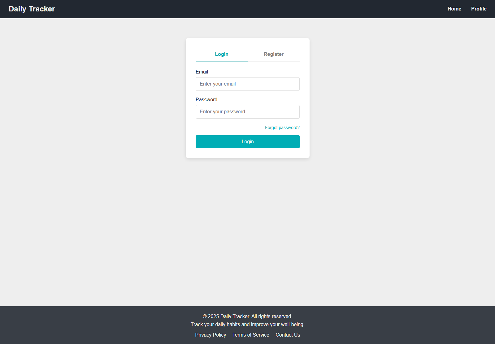
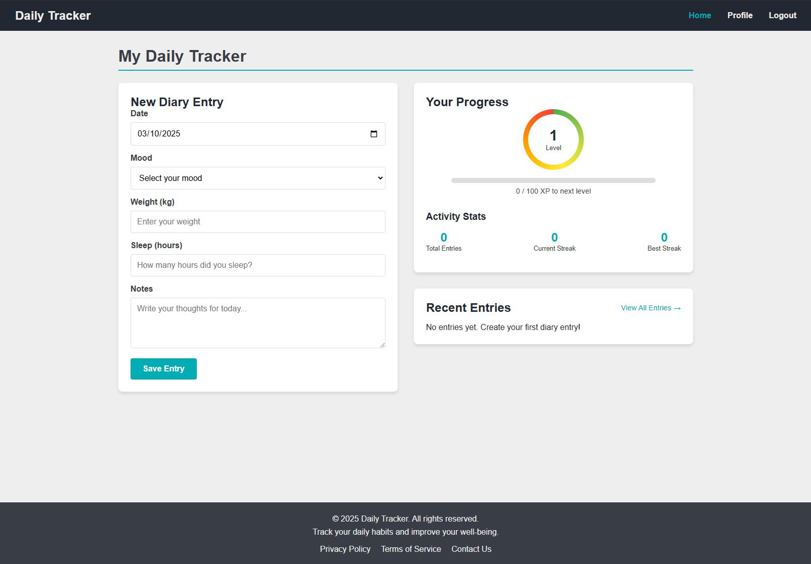
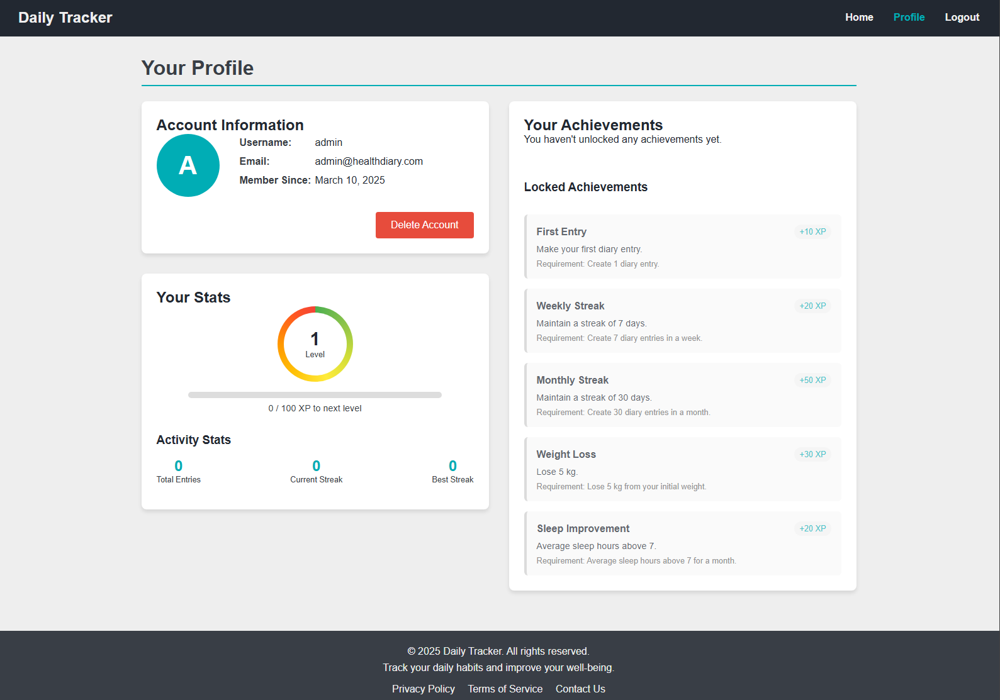
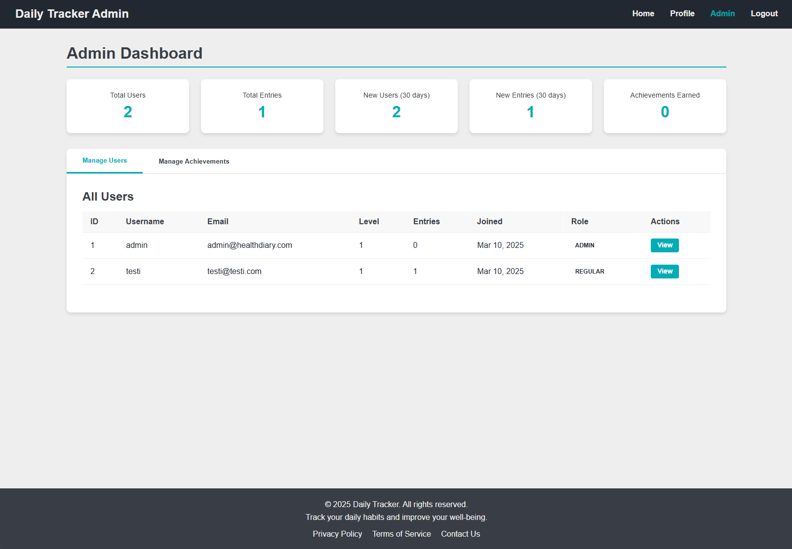
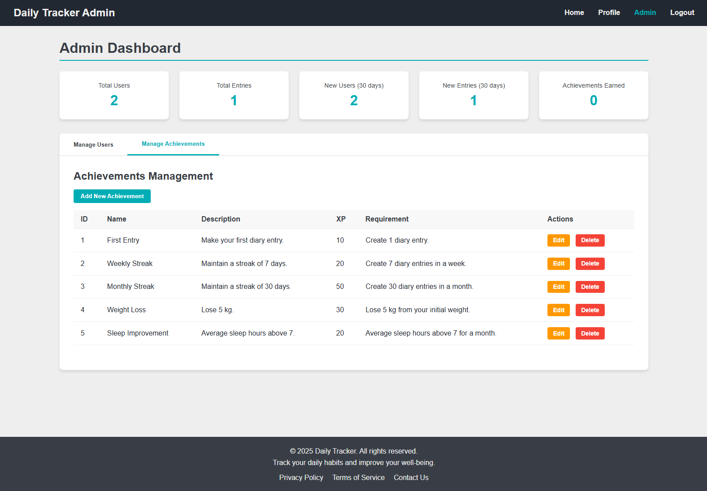
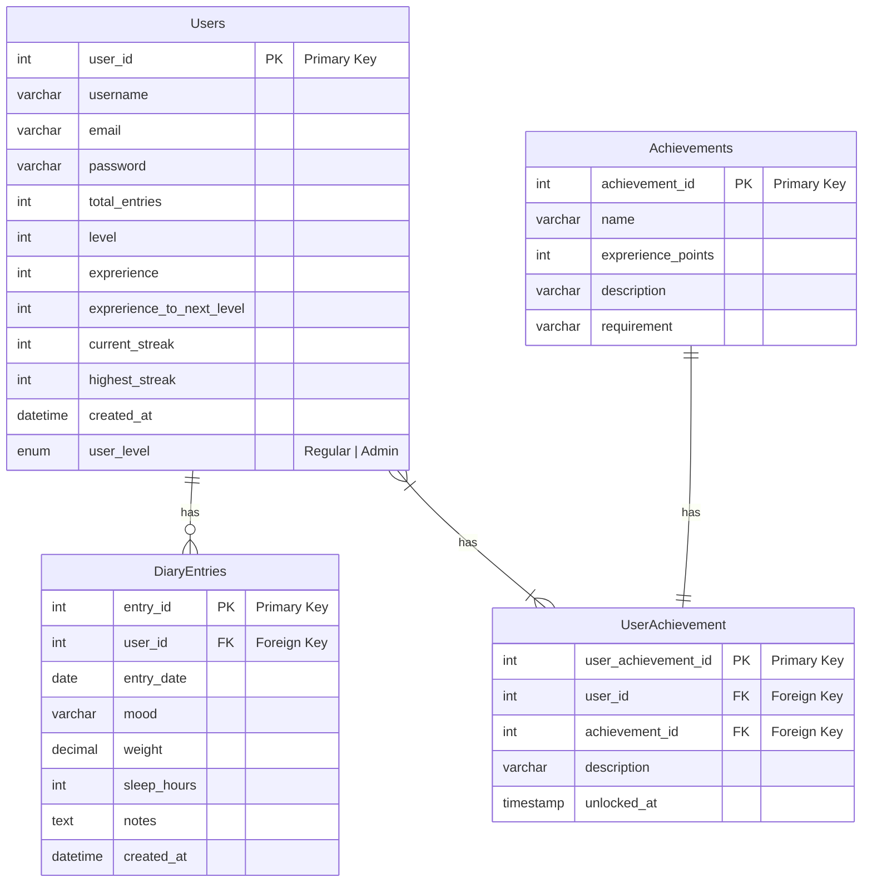

# Health Diary

A school project

## Screenshots

## Links to app

[frontend - localhost:5173](https://localhost:5173/)

[backend - localhost:3000](https://localhost:3000/)

## API Documentation

[apidoc](localhost:3000/api)

## Database

## Features

- Leveling
- Achievements
- Entry streak
- Admin dashboard

## Bugs/problems

- The user cannot get the achievements "First entry", "Weight loss" or "Sleep improvement".
- Achievements "Weekly streak" and "Monthly streak" condition is checked from total entries, not highest streak (?).
- When deleting an entry, activity stats won't update.

## References

For help and problems with code, I used Claude 3.7 Sonnet and GitHub Copilot.

[color pallette](https://colorhunt.co/palette/22283131363f76abaeeeeeee)

## Other stuff

Admin dashboard is accessible from URL only. (http://localhost:5173/src/pages/admin.html)

Both frontend and backend have separate node_modules -folders, so you need to cd in to their respective directories and then install.
