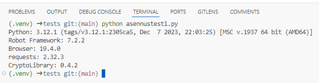
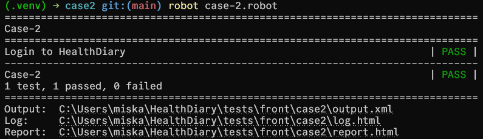
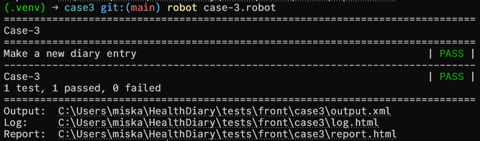
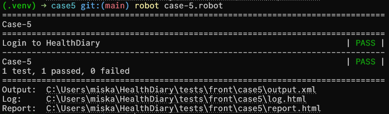
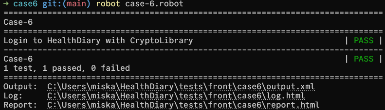

# Test documentation

For testing I use Robot Framework

## Case 1. Installing Robot Framework and libraries

### 1. Virtual enviroment

Create .venv folder

```bash
python -m venv .venv
```

Activate the virtual enviroment

- Windows

```bash
.venv\Scripts\activate
```

- macOS

```bash
source .venv/bin/activate
```

Add .venv folder to .gitignore.

### 2. Install Robot Framework

Install Robot Framework

```bash
pip install robotframework
```

Install Browser library

```bash
pip install robotframework-browser
```

Initialize the library

```bash
rfbrowser init
```

Install Requests library

```bash
pip install robotframework-requests
```

Install Crypto library

```bash
pip install --upgrade robotframework-crypto
```

Install Robotidy

```bash
pip install robotframework-tidy
```

### 3. Create `requirements.txt`

```bash
pip freeze > requirements.txt
```

This generates the `requirements.txt` which includes the list from `pip freeze`

### 4. Test the installation

I tested the installation using [asennustesti.py](asennustesti.py)



## Case 2. HealthDiary login test

[Case 2](../tests/frontend/case2/)

```robotframework
*** Settings ***
Library     Browser
Resource    ../Keywords.robot

*** Test Cases ***
Login to HealthDiary
    New Browser    chromium    headless=No
    New Page    http://localhost:5173

    # Hae sivun otsikko ja tarkista, että se on odotettu
    ${PageTitle}=  Get Title
    Should Be Equal As Strings    ${PageTitle}    Daily Tracker - Login

    # Kirjoita käyttäjätunnus ja salasana
    Type Text    id=login-email    ${email}
    Type Secret  id=login-password    $password

    # Hae elementti kirjautumispainikkeelle ja napsauta sitä
    ${login}=    Get Element    xpath=//button[@class="auth-btn" and text()="Login"]
    Click    ${login}
```

- `Resource    ../Keywords.robot` refrence to a file similar to .env. It contains passwords and other sensitive variables.
- `New Browser    chromium    headless=No` Open a new Chromium window in a no-headless state, so the window opens during testing.
- `New Page    http://localhost:5173` Open a new tab and loads the given URL.
- `${PageTitle}=  Get Title`
  `Should Be Equal As Strings    ${PageTitle}    Daily Tracker - Login` Check that the tab title is "Daily Tracker - Login".
- `Type Text    id=login-email    ${email}` Get `email` variable from `keywords.robot` and write it into a text field with id `login-email`.
- `Type Secret  id=login-password    $password` Get `password` variable from `keywords.robot` and write it into a password field with id `login-password`.
- `${login}=    Get Element    xpath=//button[@class="auth-btn" and text()="Login"]`
  `Click    ${login}` Get login button element through xpath and click it.

And then run the test in terminal with command

```bash
robot case-2.robot
```



[Case 2 logs](../tests/frontend/case2/log.html)

[Case 2 report](../tests/frontend/case2/report.html)

## Case 4. Make a new diary entry

[Case 4](../tests/frontend/case4/)

```robotframework
*** Settings ***
Library     Browser    auto_closing_level=KEEP
Resource    ../Keywords.robot
```

- `Browser` library is loaded with the `auto_closing_level=KEEP` parameter, which keeps the browser open aftet test exection
- `Keywords.robot` resource file is loaded, which contains the variables needed for login (email and password)

```robotframework
*** Test Cases ***
Make a new diary entry
    New Browser    chromium    headless=No
    New Page    http://localhost:5173
```

- Opens a new Chromium browser in visible mode (not headless)
- Navigates to the HealthDiary URL through localhost

```robotframework
# Get the page title and check that it is as expected
${PageTitle}=  Get Title
Should Be Equal As Strings    ${PageTitle}    Daily Tracker - Login
```

- Retrieves the page title and verifies it is "Daily Tracker - Login"

```robotframework
# Write the username and password
Type Text    id=login-email    ${email}
Type Secret  id=login-password    $password

# Get the element for the login button and click it
${login}=    Get Element    xpath=//button[@class="auth-btn" and text()="Login"]
Click    ${login}
```

- Enters the email and password from the `Keywords.robot` resource file.
- Finds the login button with the specific XPath and clicks it.

```robotframework
# Get the 'great' value from the mood dropdown
Select Options By    id=mood    value    great

# Write the weight, sleep and notes
Type Text    id=weight    70
Type Text    id=sleep    8
Type Text    id=notes    This is a test note.
```

- Selects "great" from the mood dropdown.
- Enters values for weight (70), sleep hours (8) and adds a note.

```robotframework
# Get the element for the submit button and click it
${submit}=    Get Element    xpath=//button[@type="submit" and text()="Save Entry"]
Click    ${submit}
```

- Finds the save button with specific XPath and clicks it to submit the diary entry

And then run the test with command:

```bash
robot case-3.robot
```



[Case 4 logs](../tests/frontend/case4/log.html)

[Case 4 report](../tests/frontend/case4/report.html)

GitHub Copilot with Claude 3.7 Sonnet (preview) was used to write this documentation.

## Case 5. HealthDiary login test using .env

[case 5](../tests/frontend/case5)

The test is exatly the same as it is in case 2 but the `EMAIL` and `PASSWORD` are loaded from a .env file with [load_env.py](../tests/load_env.py) and

```robotframework
Variables    ../load_env.py
```



[Case 5 logs](../tests/frontend/case5/log.html)

[Case 5 report](../tests/frontend/case5/report.html)

## Case 6. HealthDiary login test using CryptoLibrary

[case 6](../tests/frontend/case6/)

The test is exatly the same as it is in case 2 but the `EMAIL` and `PASSWORD` are crypted using [CryptoLibrary](https://pypi.org/project/robotframework-crypto/)



[Case 6 logs](../tests/frontend/case6/log.html)

[Case 6 report](../tests/frontend/case6/report.html)

## Case 7. Test log and report files to outputs/ -folder

Due to my filestructure, there is no need for a separate outputs/ -folder.

## Case 8. Make a GitHub.io page for test logs and reports

I set up the GitHub.io page from my repository settings, under the 'pages' -section.

Documentations are updated to include links to their respective log and report files.
